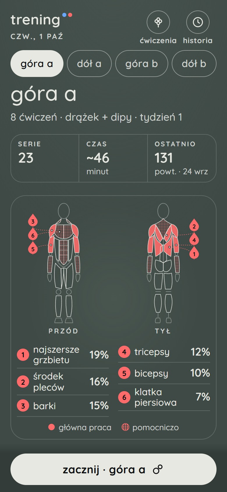
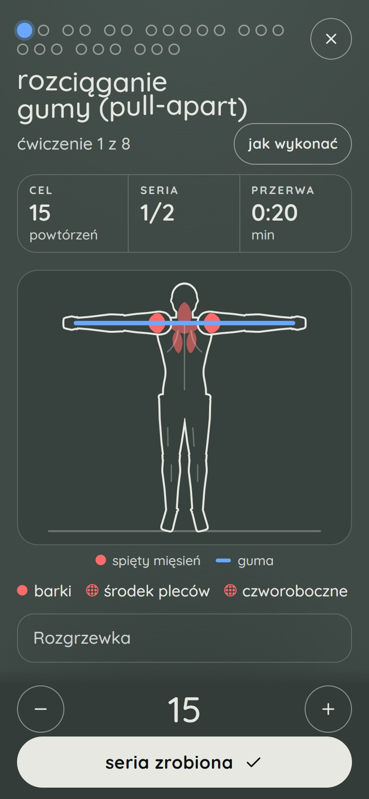
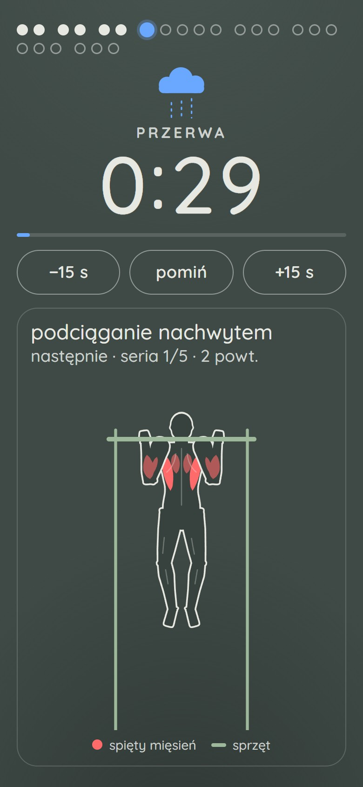
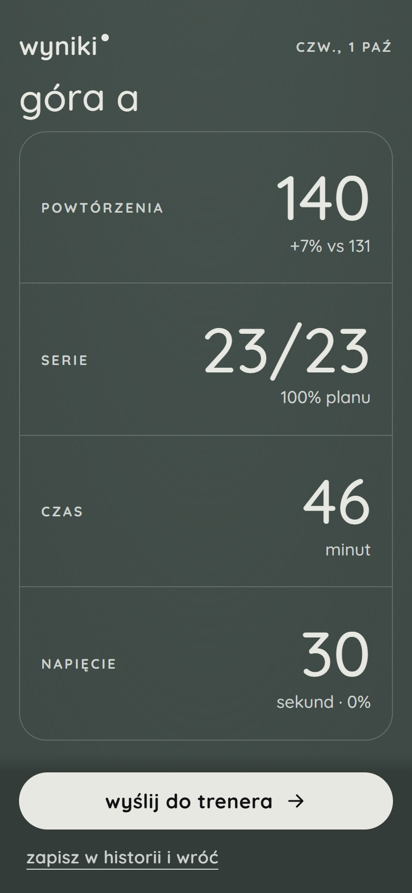
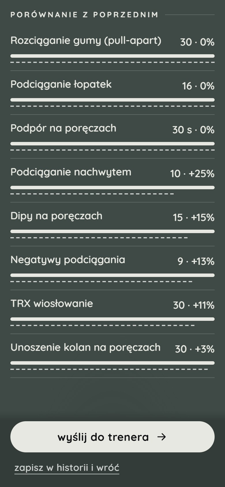
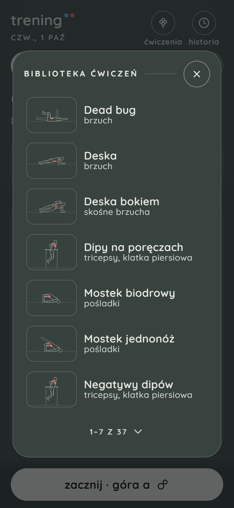

# trening

Aplikacja na telefon do treningu z trenerem. Każda osoba dostaje własny plan, ułożony pod jej cel (zdrowie, sylwetka, samopoczucie), doświadczenie, sprzęt i miejsce: na dworze, na siłowni albo w domu.

Aplikacja prowadzi przez trening seria po serii: pokazuje, co teraz zrobić i jak, odlicza przerwę i zbiera wyniki dla trenera.

Otwórz: https://kenseikun.github.io/trening/

  
  
  

## Co potrafi

- **Plan tygodnia od trenera.** Rozpiska sama pojawia się w aplikacji, a od razu widać treningi tygodnia: ile serii, ile czasu i które mięśnie popracują.
- **Technika pod ręką.** Każde ćwiczenie ma animację z podświetlonymi mięśniami i instrukcję krok po kroku.
- **Przerwy bez zegarka.** Aplikacja odlicza przerwę, daje sygnał na koniec i pokazuje, co będzie następne.
- **Ciężar i samopoczucie.** Przy ćwiczeniach z obciążeniem zapisujesz ciężar, a po treningu dwoma dotknięciami oceniasz, jak było, i zgłaszasz, jeśli coś bolało.
- **Wyniki dla trenera.** Po treningu widzisz liczby i porównanie z poprzednim razem, a podsumowanie wysyłasz trenerowi jednym przyciskiem.
- **Działa bez zasięgu.** Po pierwszym otwarciu aplikacja jest w telefonie i nie potrzebuje internetu.

  
  
  

## Instalacja

### Android

1. Otwórz na telefonie stronę [Releases](https://github.com/Kenseikun/trening/releases/latest) i pobierz plik z końcówką `.apk`.
2. Otwórz pobrany plik. Telefon zapyta o zgodę na instalowanie aplikacji z tego źródła: zezwól i wróć.
3. Dotknij „Zainstaluj”, a potem „Otwórz”.

Można też bez pliku: otwórz https://kenseikun.github.io/trening/ w Chrome, wejdź w menu (⋮) i wybierz „Dodaj do ekranu głównego” albo „Zainstaluj aplikację”.

### iPhone

Na iPhonie nie pobiera się pliku. Aplikację dodaje się z Safari:

1. Otwórz w **Safari** adres https://kenseikun.github.io/trening/
2. Dotknij „Udostępnij” (kwadrat ze strzałką w górę; jeśli go nie widać, jest w menu „···”).
3. Wybierz „Do ekranu początkowego” i potwierdź „Dodaj”.

Ikona „Trening” pojawi się na ekranie początkowym, a aplikacja otworzy się na pełnym ekranie. Na czas treningu wyłącz tryb cichy: sygnał końca przerwy to dźwięk.

## Pierwsze uruchomienie

Na pierwszym ekranie wpisz inicjały i kod od trenera albo otwórz link aktywacyjny od trenera. Potem aplikacja zada kilka pytań (np. o doświadczenie, cel i sprzęt), z których trener ułoży plan. Wystarczy raz: potem aplikacja działa też bez zasięgu, a każda nowa rozpiska pojawia się sama.

Na iPhonie link otworzy się w Safari, a nie w aplikacji z ekranu początkowego, więc tam kod najlepiej wpisać ręcznie.

## Aktualizacje

Aplikacja aktualizuje się sama: gdy pojawi się nowa wersja, zapyta o przeładowanie. Pliku APK nie trzeba pobierać ponownie.

---

Projekt prywatny. Bez wsparcia i bez gwarancji.
